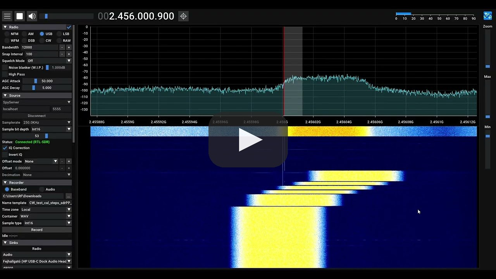
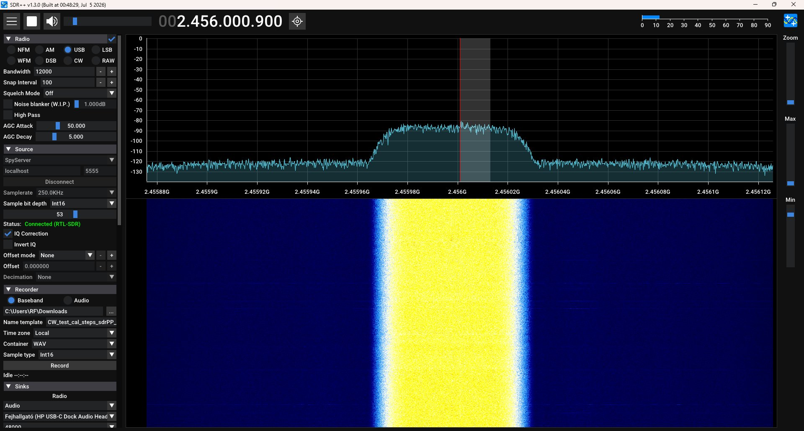
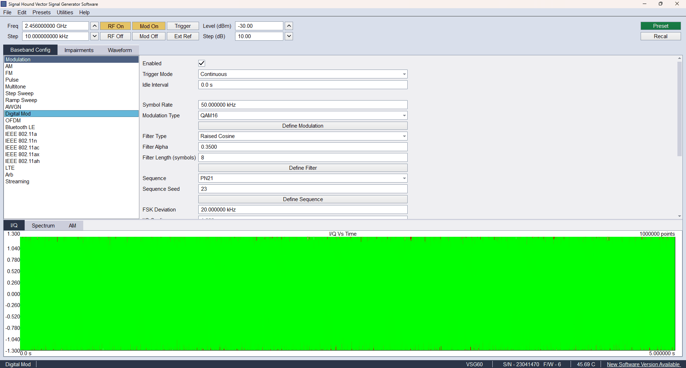
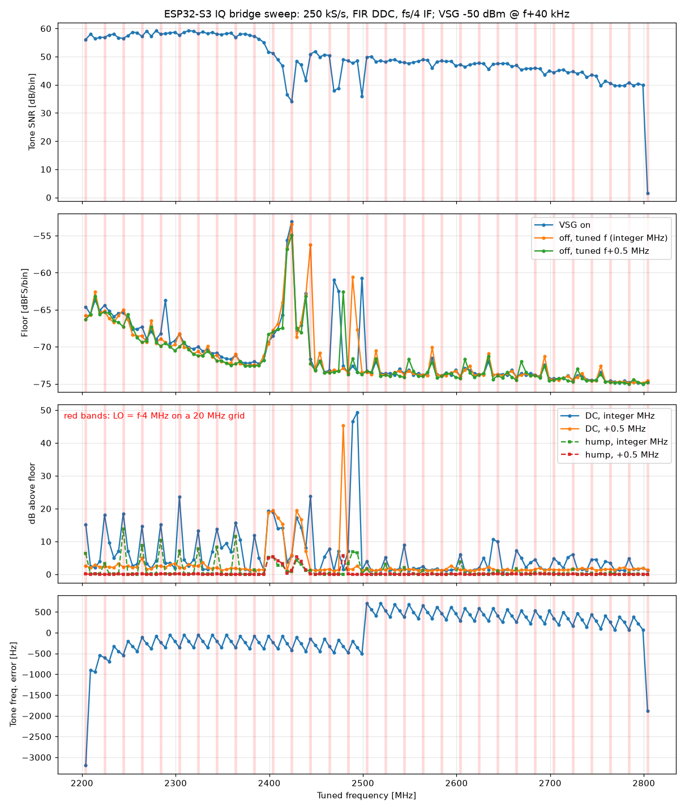

# esp-sdr-bridge

[](https://youtu.be/9M-mIbKxqZ4)

*Demo video (YouTube)*

Real IQ from an ESP32-S3 running [ESP-SDR](https://github.com/ESPARGOS/esp-sdr) into **SDR++**, **SDR#**, **GNU Radio**, gqrx and anything else that speaks **SpyServer** or **rtl_tcp**, over the plain USB cable.

The ESP32-S3 samples the 2.4 GHz band at 16 MS/s; a two-stage decimating FIR (DDC) running on the second core with the S3 PIE SIMD instructions produces a gapless complex baseband stream, which this bridge serves on the network.



*SDR++ connected to the SpyServer bridge (250 kS/s, int16), receiving a 50 ksym/s QAM16 signal (raised cosine, alpha 0.35, PN21) at 2456 MHz generated by a Signal Hound VSG60:*



| Output rate | USB link | Use |
|---|---|---|
| 250 kS/s | 8-bit IQ, TPDF-dithered | default, ~200 kHz flat passband |
| 125 kS/s | 16-bit IQ | more dynamic range |
| 62.5 kS/s | 16-bit IQ | narrow signals |

Tuning range 2204 to 2804 MHz in 1 kHz steps. The bandwidth is limited by the S3 USB Serial/JTAG port (~0.65 MB/s of payload).

## Quick start

1. Flash the ESP32-S3 with ESP-SDR firmware that has the `IQS` stream command. Download `esp-sdr-s3-iq-stream.bin` from [Releases](../../releases/latest) (one merged image, flash at offset `0x0`):
   - in the browser, no install: [ESP Tool web flasher](https://espressif.github.io/esptool-js/) (Chrome/Edge), connect to the board's native USB port, address `0x0`, Program;
   - or from the command line: `esptool --chip esp32s3 --after watchdog_reset write_flash 0x0 esp-sdr-s3-iq-stream.bin`.

   If the board stays silent after flashing, it is still in the bootloader: press RESET or unplug and replug it.

   Source: branch [`s3-iq-stream`](https://github.com/zodoczi/esp-sdr/tree/s3-iq-stream), upstream pull request [ESPARGOS/esp-sdr#4](https://github.com/ESPARGOS/esp-sdr/pull/4).
2. Run the bridge (use the board's **native USB** port; on Linux it is `/dev/ttyACM0`):
   - Windows: download `esp-sdr-bridge-windows-x64.exe` from [Releases](../../releases/latest) and run `esp-sdr-bridge-windows-x64.exe --port COM4`
   - Linux / macOS: `pipx install git+https://github.com/z2labs/esp-sdr-bridge` then `esp-sdr-bridge --port /dev/ttyACM0`, or the `linux-x64` / `macos-arm64` binary from Releases (`chmod +x` first)
3. Connect your SDR software:
   - **SDR++ / SDR#**: Source *SpyServer*, `localhost:5555`, sample bit depth *Int16*
   - **SDR++ / gqrx / GNU Radio**: Source *RTL-TCP*, `localhost:1234`

```
esp-sdr-bridge --port COM4 [--spyserver 0.0.0.0:5555] [--rtltcp 0.0.0.0:1234]
               [--freq 2450e6] [--gain 60] [--ppm 0] [--fake]
```

**Remote use:** the bridge listens on all interfaces, so any device on the LAN can connect, e.g. SDR++ on an Android phone or tablet (SpyServer source, `<PC IP>:5555`) while the ESP32-S3 and the bridge stay at the PC. Allow the ports in the PC firewall; on an untrusted network bind to one interface with `--spyserver <IP>:5555`.

`--fake` serves a synthetic tone without hardware (protocol tests). `tools/ss_client.py` is a minimal SpyServer client that measures rate, tone frequency, level and SNR for every rate and sample format.

## Measured

> 📄 **[Full measurement report (PDF)](docs/ESP32-S3_IQ_bridge_measurements.pdf)** · **[Detailed results: ~90-minute soak test, 1 MHz CW sweep, PLL spur analysis](docs/MEASUREMENTS.md)**

ESP32-S3 dev board, VSG CW at -50 dBm, 40 kHz above the tuned frequency, gain index 60:

| Rate | Format | Rate measured | Tone SNR (per bin) |
|---|---|---|---|
| 250 kS/s | int16 / uint8 / float | 249.6 to 250.4 kS/s | 60.6 / 59.4 / 60.6 dB |
| 125 kS/s | int16 / uint8 / float | 124.8 to 125.1 kS/s | 63.5 / 61.5 / 63.7 dB |

No CRC errors. Full-band sweep, 2204 to 2804 MHz in 5 MHz steps (rtl_tcp path, 8-bit):



Known effects:
- When the LO (tuned frequency minus 4 MHz) falls on a 20 MHz grid, a PLL spur hump appears at the band centre (2.2 to 2.4 GHz mainly); tuning 0.5 MHz away removes it.
- The S3 front end gain drops above ~2.45 GHz (about 10 dB at 2.6 GHz, more towards 2.8 GHz).
- Frequency error is about -1 ppm right after start and settles near -0.1 ppm after a few minutes of warm-up.

## How it works

- LO is tuned fs/4 (4 MHz) below the wanted frequency and the chip shifts the samples by +fs/4 before filtering, so the LO leakage and the 1/f hump at 0 Hz IF fall outside the output band.
- Stage 1: decimate by 8, 32 taps (triangle convolved with a Kaiser window, double zeros at the aliasing frequencies). Stage 2: decimate by 8/16/32, Kaiser beta 5.65. About 12 CPU cycles per input sample pair on the second core.
- Frames (IQS1: 24-byte header with a 64-bit sample index, payload, CRC32) are checked for CRC and continuity by the bridge, which removes the residual DC and serves SpyServer (int16 / uint8 / float) and rtl_tcp (uint8) clients.

## Credits

- [ESP-SDR](https://github.com/ESPARGOS/esp-sdr) by the ESPARGOS project: firmware and the original idea of using the ESP32 radio as an SDR.
- Turbo Mode developed by Zoltan Doczi from https://www.z2labs.io
- SpyServer protocol by Youssef Touil (Airspy); rtl_tcp from the rtl-sdr project.

## License

GPL-3.0, same as ESP-SDR. Copyright (c) 2026 Zoltan Doczi.
Detailed results, including an 87-minute soak test: [docs/MEASUREMENTS.md](docs/MEASUREMENTS.md)
