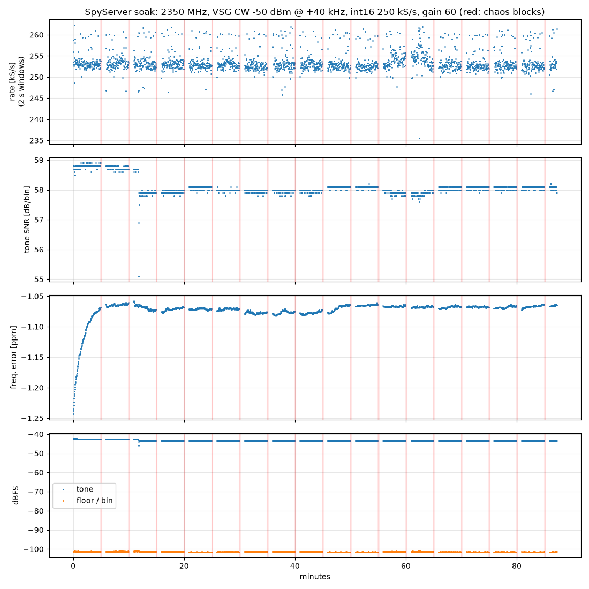
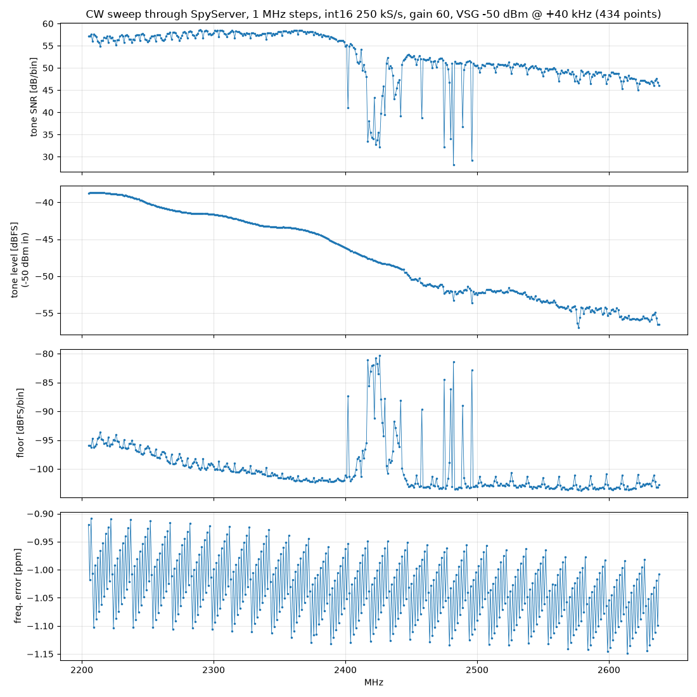

# Measurements

Setup: ESP32-S3 dev board with ESP-SDR `s3-iq-stream` firmware (IQS, FIR DDC on core 1, fs/4 IF), USB Serial/JTAG to a Windows PC, `esp-sdr-bridge` (SpyServer). Signal Hound VSG60 CW into the board, never above -50 dBm. The test client (`tools/ss_client.py`, and the soak script) sends exactly the SpyServer commands SDR++ sends.

SNR is tone power over the noise floor per FFT bin (8192-point Hann; 30.5 Hz bins at 250 kS/s). dBFS is relative to int16 full scale.

## Soak test, 87 minutes (2026-10-02)

2350 MHz, CW at +40 kHz, -50 dBm, int16, 250 kS/s, gain index 60, 2 s analysis windows back to back. Every 5 minutes a chaos block: 3 random hops in 2210-2790 MHz, 125k and 62.5k, uint8 and float formats, gain 40 and 70, VSG off, client disconnect + reconnect (17 blocks).

| Steady state (2148 windows) | p1 | median | p99 |
|---|---|---|---|
| Output rate (2 s windows, wall clock) | 249.8 kS/s | 253.0 kS/s | 260.9 kS/s |
| Tone SNR | 57.8 dB | 58.0 dB | 58.8 dB |
| Tone level | -43.5 dBFS | -43.4 dBFS | -42.4 dBFS |
| Noise floor | -101.5 dBFS/bin | -101.4 dBFS/bin | -101.1 dBFS/bin |
| Frequency error | -1.17 ppm | -1.07 ppm | -1.06 ppm |

- Stream integrity: 2.5 million IQS1 frames, 0 CRC errors, 0 SpyServer sequence gaps, 0 messages dropped by the bridge. The firmware reported 8 dropped-frame events (38912 samples, 0.003 % of the stream) in two clusters, 10:23:56 and 10:25:12-14: the PC stopped reading USB for a moment (frame flags bit 1 = dropped in the S3 because its TX queue was full). Every such gap is visible to the host by the 64-bit sample index.
- The frequency error is a constant crystal offset of this board (-1.07 ppm, i.e. `--ppm 1.07`), stable over the whole run after the first minutes (~0.15 ppm warm-up).
- The windowed rate estimate reads ~1 % high (timing starts at the first message, which arrives after a USB burst); with 0 sequence gaps and 0 lost samples in steady state the delivered rate is exactly 250 kS/s.
- At ~12 minutes the tone level stepped down by 1.0 dB (and the SNR with it) and stayed there; the floor did not move, so this is in the signal path (VSG or RF), not in the stream. Not yet explained.

| Chaos step (median of 17) | Rate | SNR | Tone | Floor |
|---|---|---|---|---|
| 125 kS/s int16 | 126.0 kS/s | 61.4 dB | -43.4 dBFS | -104.8 |
| 62.5 kS/s int16 (tone at +15 kHz) | 62.5 kS/s | 64.9 dB | -43.4 dBFS | -108.3 |
| 250 kS/s uint8 | 256 kS/s | 56.9 dB | -43.4 dBFS | -100.2 |
| 250 kS/s float | 256 kS/s | 58.0 dB | -43.4 dBFS | -101.4 |
| gain 40 | 255 kS/s | 44.9 dB | -63.6 dBFS | -108.5 |
| gain 70 | 256 kS/s | 58.8 dB | -33.9 dBFS | -92.7 |
| after reconnect | 256 kS/s | 58.1 dB | -43.4 dBFS | -101.5 |
| random hops 2210-2790 MHz (51) | 251 kS/s | 49.7 dB | -51.5 dBFS | -102.6 |

The level is the same for every rate and format (the bridge keeps samples in FIR units), so switching in the client does not change calibration.

## CW sweep, 1 MHz steps (SpyServer, int16, 250 kS/s, gain 60)

VSG CW at -50 dBm, 40 kHz above each tuned frequency, 1 s per point after 1.5 s settling; 2205-2638 MHz measured so far (434 points, run stopped when the PC was moved), 0 sequence gaps.

| Band | SNR median (min) | Tone level | Floor |
|---|---|---|---|
| 2205-2400 MHz | 57.5 dB (54.9) | -41.7 dBFS | -99.7 dBFS/bin |
| 2400-2485 MHz | 51.0 dB (28.2) | -49.0 dBFS | -101.0 dBFS/bin |
| 2485-2600 MHz | 49.8 dB (29.2) | -53.0 dBFS | -103.0 dBFS/bin |
| 2600-2638 MHz | 47.2 dB (45.1) | -55.7 dBFS | -103.1 dBFS/bin |

- The receive gain at a fixed gain index falls smoothly by ~17 dB from 2.2 to 2.64 GHz (tone level plot); the SNR follows it, so a per-frequency gain correction can flatten the level but not the SNR.
- The SNR dips and floor spikes in 2.40-2.50 GHz are live Wi-Fi/Bluetooth traffic in the lab (the floor is measured with the VSG on, in the whole passband).
- The frequency error is -1.02 to -1.06 ppm (crystal) plus a ±0.1 ppm sawtooth repeating every few MHz: the fractional resolution of the PLL with 1 kHz `FOFS` steps. Below ±250 Hz at 2.4 GHz.

## Full-band sweep (rtl_tcp path, 5 MHz steps)

See the README plot: SNR 56-59 dB from 2.2 to 2.4 GHz, front-end gain falling above ~2.45 GHz (about 48 dB SNR at 2.6 GHz, 40 dB at 2.8 GHz), Wi-Fi/BT traffic visible in 2.40-2.48 GHz, a PLL spur hump when the LO (tuned frequency - 4 MHz) is on a 20 MHz grid.
